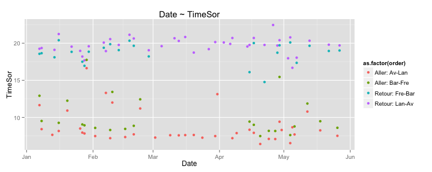
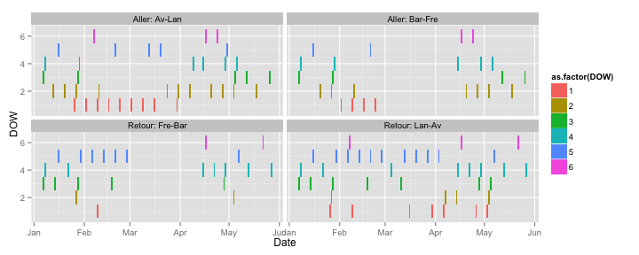
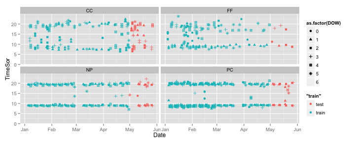
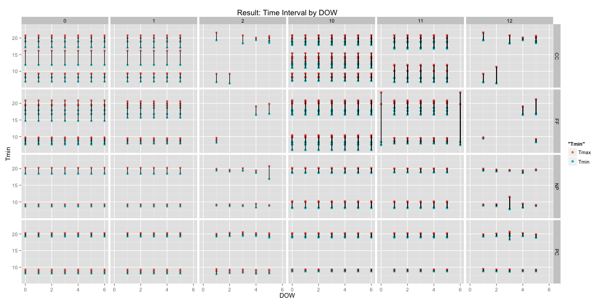

# Models Results

## CC


```
## Joining by: c("Entr", "Sor")
```

```
## Source: local data frame [4 x 4]
## 
##       Entr      Sor  n           order
## 1 25004220 25004211 40  Retour: Lan-Av
## 2 25004211 25004220 39   Aller: Av-Lan
## 3 25006002 25006009 24  Aller: Bar-Fre
## 4 25006009 25006002 24 Retour: Fre-Bar
```

   


## Original points
 

## Result Time Interval by DOW
 

## Result Geo-representation
 

## Result Geo-representation for CC
 


## Result of CC in details

```r
print(Ind, n = 24)
```

```
## Source: local data frame [24 x 6]
## 
##    ID      Ind1      Ind2      Ind3         Ind Model
## 1  CC 0.3500000 0.6500000 0.9000000 -0.48000000     0
## 2  FF 0.4285714 0.5714286 0.9821429 -0.33928571     0
## 3  NP 0.7391304 0.2608696 0.6964286  0.33897516     0
## 4  PC 0.6363636 0.3636364 0.8750000  0.09772727     0
## 5  CC 0.3000000 0.7000000 0.8600000 -0.57200000     1
## 6  FF 0.4285714 0.5714286 0.9750000 -0.33785714     1
## 7  NP 0.7391304 0.2608696 0.5750000  0.36326087     1
## 8  PC 0.6363636 0.3636364 0.8250000  0.10772727     1
## 9  CC 0.0750000 0.9250000 0.7142857 -0.99285714     2
## 10 FF 0.1428571 0.8571429 0.9375000 -0.90178571     2
## 11 NP 0.6086957 0.3913043 0.6500000  0.08739130     2
## 12 PC 0.6363636 0.3636364 0.8250000  0.10772727     2
## 13 CC 0.4196429 0.5803571 0.9270186 -0.34611801    10
## 14 FF 0.5256410 0.4743590 0.9569328 -0.14010450    10
## 15 NP 0.7272727 0.2727273 0.7142857  0.31168831    10
## 16 PC 0.5000000 0.5000000 0.7448980 -0.14897959    10
## 17 CC 0.4776786 0.5223214 0.8078125 -0.20620536    11
## 18 FF 0.4358974 0.5641026 0.9532967 -0.31886447    11
## 19 NP 0.7272727 0.2727273 0.6000000  0.33454545    11
## 20 PC 0.5000000 0.5000000 0.6428571 -0.12857143    11
## 21 CC 0.0937500 0.9062500 0.6813725 -0.94877451    12
## 22 FF 0.0000000 1.0000000 1.0000000 -1.20000000    12
## 23 NP 0.5909091 0.4090909 0.6750000  0.04681818    12
## 24 PC 0.5000000 0.5000000 0.6428571 -0.12857143    12
```

```r
Ind.result
```

```
## Source: local data frame [4 x 2]
## 
##   ID Model
## 1 CC    11
## 2 FF    10
## 3 NP     1
## 4 PC     3
```

```r
print(result.final %>% filter(ID == "CC"), n = 100) 
```

```
## Source: local data frame [160 x 6]
## Groups: ID, Entr
## 
##     ID     Entr      Sor DOW      Tmin     Tmax
## 1   CC 25004211 25004212   1  6.739158 10.10682
## 2   CC 25004212 25004211   1 18.927778 20.80878
## 3   CC 25004212 25004213   1  6.739158 10.10682
## 4   CC 25004213 25004212   1 18.927778 20.80878
## 5   CC 25004213 25004214   1  6.739158 10.10682
## 6   CC 25004214 25004213   1 18.927778 20.80878
## 7   CC 25004214 25004215   1  6.739158 10.10682
## 8   CC 25004215 25004214   1 18.927778 20.80878
## 9   CC 25004215 25004220   1  6.739158 10.10682
## 10  CC 25004220 25004215   1 18.927778 20.80878
## 11  CC 25004220 25004278   1  6.739158 10.10682
## 12  CC 25004220 25004278   1 18.679512 20.85486
## 13  CC 25004278 25004279   1  6.739158 10.10682
## 14  CC 25004278 25004279   1 18.679512 20.85486
## 15  CC 25004279 25006001   1  7.876037 11.73507
## 16  CC 25004279 25006001   1 16.791336 19.89533
## 17  CC 25006001 25006080   1  7.876037 11.73507
## 18  CC 25006001 25006080   1 16.791336 19.89533
## 19  CC 25006002 25006003   1  7.876037 11.73507
## 20  CC 25006003 25006002   1 17.074436 19.99964
## 21  CC 25006003 25006004   1  7.876037 11.73507
## 22  CC 25006004 25006003   1 17.074436 19.99964
## 23  CC 25006004 25006005   1  7.995821 11.92710
## 24  CC 25006005 25006004   1 17.074436 19.99964
## 25  CC 25006005 25006007   1  7.995821 11.92710
## 26  CC 25006007 25006005   1 17.074436 19.99964
## 27  CC 25006007 25006008   1  7.995821 11.92710
## 28  CC 25006008 25006007   1 17.074436 19.99964
## 29  CC 25006008 25006009   1  7.995821 11.92710
## 30  CC 25006009 25006008   1 17.074436 19.99964
## 31  CC 25006080 25006002   1  7.876037 11.73507
## 32  CC 25006080 25006002   1 16.791336 19.89533
## 33  CC 25004211 25004212   2  6.739158 10.10682
## 34  CC 25004212 25004211   2 18.927778 20.80878
## 35  CC 25004212 25004213   2  6.739158 10.10682
## 36  CC 25004213 25004212   2 18.927778 20.80878
## 37  CC 25004213 25004214   2  6.739158 10.10682
## 38  CC 25004214 25004213   2 18.927778 20.80878
## 39  CC 25004214 25004215   2  6.739158 10.10682
## 40  CC 25004215 25004214   2 18.927778 20.80878
## 41  CC 25004215 25004220   2  6.739158 10.10682
## 42  CC 25004220 25004215   2 18.927778 20.80878
## 43  CC 25004220 25004278   2  6.739158 10.10682
## 44  CC 25004220 25004278   2 18.679512 20.85486
## 45  CC 25004278 25004279   2  6.739158 10.10682
## 46  CC 25004278 25004279   2 18.679512 20.85486
## 47  CC 25004279 25006001   2  7.876037 11.73507
## 48  CC 25004279 25006001   2 16.791336 19.89533
## 49  CC 25006001 25006080   2  7.876037 11.73507
## 50  CC 25006001 25006080   2 16.791336 19.89533
## 51  CC 25006002 25006003   2  7.876037 11.73507
## 52  CC 25006003 25006002   2 17.074436 19.99964
## 53  CC 25006003 25006004   2  7.876037 11.73507
## 54  CC 25006004 25006003   2 17.074436 19.99964
## 55  CC 25006004 25006005   2  7.995821 11.92710
## 56  CC 25006005 25006004   2 17.074436 19.99964
## 57  CC 25006005 25006007   2  7.995821 11.92710
## 58  CC 25006007 25006005   2 17.074436 19.99964
## 59  CC 25006007 25006008   2  7.995821 11.92710
## 60  CC 25006008 25006007   2 17.074436 19.99964
## 61  CC 25006008 25006009   2  7.995821 11.92710
## 62  CC 25006009 25006008   2 17.074436 19.99964
## 63  CC 25006080 25006002   2  7.876037 11.73507
## 64  CC 25006080 25006002   2 16.791336 19.89533
## 65  CC 25004211 25004212   3  6.739158 10.10682
## 66  CC 25004212 25004211   3 18.927778 20.80878
## 67  CC 25004212 25004213   3  6.739158 10.10682
## 68  CC 25004213 25004212   3 18.927778 20.80878
## 69  CC 25004213 25004214   3  6.739158 10.10682
## 70  CC 25004214 25004213   3 18.927778 20.80878
## 71  CC 25004214 25004215   3  6.739158 10.10682
## 72  CC 25004215 25004214   3 18.927778 20.80878
## 73  CC 25004215 25004220   3  6.739158 10.10682
## 74  CC 25004220 25004215   3 18.927778 20.80878
## 75  CC 25004220 25004278   3  6.739158 10.10682
## 76  CC 25004220 25004278   3 18.679512 20.85486
## 77  CC 25004278 25004279   3  6.739158 10.10682
## 78  CC 25004278 25004279   3 18.679512 20.85486
## 79  CC 25004279 25006001   3  7.876037 11.73507
## 80  CC 25004279 25006001   3 16.791336 19.89533
## 81  CC 25006001 25006080   3  7.876037 11.73507
## 82  CC 25006001 25006080   3 16.791336 19.89533
## 83  CC 25006002 25006003   3  7.876037 11.73507
## 84  CC 25006003 25006002   3 17.074436 19.99964
## 85  CC 25006003 25006004   3  7.876037 11.73507
## 86  CC 25006004 25006003   3 17.074436 19.99964
## 87  CC 25006004 25006005   3  7.995821 11.92710
## 88  CC 25006005 25006004   3 17.074436 19.99964
## 89  CC 25006005 25006007   3  7.995821 11.92710
## 90  CC 25006007 25006005   3 17.074436 19.99964
## 91  CC 25006007 25006008   3  7.995821 11.92710
## 92  CC 25006008 25006007   3 17.074436 19.99964
## 93  CC 25006008 25006009   3  7.995821 11.92710
## 94  CC 25006009 25006008   3 17.074436 19.99964
## 95  CC 25006080 25006002   3  7.876037 11.73507
## 96  CC 25006080 25006002   3 16.791336 19.89533
## 97  CC 25004211 25004212   4  6.739158 10.10682
## 98  CC 25004212 25004211   4 18.927778 20.80878
## 99  CC 25004212 25004213   4  6.739158 10.10682
## 100 CC 25004213 25004212   4 18.927778 20.80878
## ..  ..      ...      ... ...       ...      ...
```
