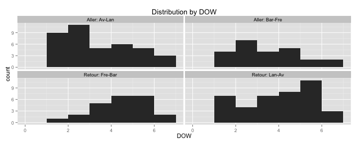

## Kmeans 

```r
ggplot(train) + geom_point(aes(Date, TimeSor, shape = as.factor(DOW)))
```

 

```r
ggplot(train) + geom_point(aes(Date, TimeSor, shape = as.factor(DOW))) + facet_wrap(~ID)
```

 

```r
for(i in 1:nrow(ID.list)){
  temp <- train %>% filter(ID == ID.list$ID[i])
  set.seed(1234)
  t.kmeans <- lapply(1:6, function(i){
    kmeans(temp[, "TimeSor"], centers = i)
  })
  
  print(ID.list$ID[i])
  print(lapply(t.kmeans, function(z) z$withinss))
  within.ss <- sapply(t.kmeans, function(z) sum(z$withinss))
  plot(1:6, type="b", xlab = paste0("Number of clusters for:", ID.list$ID[i]), ylab = "Within SS", within.ss)

  clus<- clusGap(temp[,"TimeSor"], kmeans, 10)
  print(clus)
  plot(clus)
}
```

```
## [1] "CC"
## [[1]]
## [1] 3605.707
## 
## [[2]]
## [1] 221.5505 277.9622
## 
## [[3]]
## [1] 78.96768 47.71972 57.69106
## 
## [[4]]
## [1] 21.20302 21.03556 45.90679 34.44906
## 
## [[5]]
## [1] 14.05100 13.59771 10.54193 28.65667  9.79081
## 
## [[6]]
## [1] 28.656667  6.993232  7.485821  1.797099  5.289365 13.597708
```

 

```
## Clustering k = 1,2,..., K.max (= 10): .. done
## Bootstrapping, b = 1,2,..., B (= 100)  [one "." per sample]:
## .................................................. 50 
## .................................................. 100 
## Clustering Gap statistic ["clusGap"].
## B=100 simulated reference sets, k = 1..10
##  --> Number of clusters (method 'firstSEmax', SE.factor=1): 3
##           logW   E.logW           gap     SE.sim
##  [1,] 5.271212 5.160131 -0.1110803357 0.03716601
##  [2,] 4.242443 4.462737  0.2202933902 0.04038659
##  [3,] 3.769726 4.036266  0.2665393430 0.04215347
##  [4,] 3.580723 3.731866  0.1511426967 0.04332474
##  [5,] 3.337811 3.508483  0.1706714373 0.04403941
##  [6,] 3.253070 3.324302  0.0712319924 0.05991676
##  [7,] 3.033037 3.164645  0.1316079116 0.06508976
##  [8,] 2.968204 3.034073  0.0658693554 0.07071558
##  [9,] 2.784905 2.930195  0.1452903476 0.08684972
## [10,] 2.812981 2.813908  0.0009268413 0.08274777
```

 

```
## [1] "FF"
## [[1]]
## [1] 3092.858
## 
## [[2]]
## [1] 181.0677 317.1806
## 
## [[3]]
## [1] 100.27828  74.40998  85.82972
## 
## [[4]]
## [1] 13.73389 85.90899 58.83733 23.73465
## 
## [[5]]
## [1] 18.380617 85.908987  7.640794 19.765269 13.733889
## 
## [[6]]
## [1] 10.199343 19.765269 10.416111 55.802630  7.304962 15.178758
```

 

```
## Clustering k = 1,2,..., K.max (= 10): .. done
## Bootstrapping, b = 1,2,..., B (= 100)  [one "." per sample]:
## .................................................. 50 
## .................................................. 100 
## Clustering Gap statistic ["clusGap"].
## B=100 simulated reference sets, k = 1..10
##  --> Number of clusters (method 'firstSEmax', SE.factor=1): 2
##           logW   E.logW       gap     SE.sim
##  [1,] 5.216098 5.552522 0.3364243 0.03484236
##  [2,] 4.240875 4.858885 0.6180096 0.03750406
##  [3,] 4.185536 4.430548 0.2450114 0.03782675
##  [4,] 3.646965 4.135537 0.4885713 0.04360741
##  [5,] 3.519402 3.907101 0.3876992 0.05064655
##  [6,] 3.319778 3.729177 0.4093986 0.05513900
##  [7,] 3.215957 3.567346 0.3513889 0.05713660
##  [8,] 3.021505 3.435187 0.4136819 0.07261863
##  [9,] 3.061085 3.315065 0.2539803 0.07313717
## [10,] 2.734911 3.204759 0.4698475 0.08434637
```

 

```
## [1] "NP"
## [[1]]
## [1] 3989.057
## 
## [[2]]
## [1] 75.70112 37.34469
## 
## [[3]]
## [1]  4.073333 11.575333 25.390731
## 
## [[4]]
## [1]  8.023166 11.575333  7.488037  4.073333
## 
## [[5]]
## [1]  0.000000  2.701667  4.073333  3.363866 11.575333
## 
## [[6]]
## [1]  4.073333  1.214599  2.238299  0.000000 10.938305  4.010106
```

 

```
## Clustering k = 1,2,..., K.max (= 10): .. done
## Bootstrapping, b = 1,2,..., B (= 100)  [one "." per sample]:
## .................................................. 50 
## .................................................. 100 
## Clustering Gap statistic ["clusGap"].
## B=100 simulated reference sets, k = 1..10
##  --> Number of clusters (method 'firstSEmax', SE.factor=1): 2
##           logW   E.logW         gap     SE.sim
##  [1,] 5.302384 5.244157 -0.05822706 0.03343973
##  [2,] 3.187391 4.549161  1.36176963 0.03850448
##  [3,] 2.835773 4.128069  1.29229565 0.04135501
##  [4,] 2.783777 3.827112  1.04333594 0.04847590
##  [5,] 2.578601 3.603357  1.02475521 0.04730644
##  [6,] 2.346330 3.430088  1.08375872 0.05640991
##  [7,] 2.553244 3.265307  0.71206295 0.06363567
##  [8,] 2.159781 3.127181  0.96740075 0.07694204
##  [9,] 2.061812 3.016326  0.95451467 0.09025097
## [10,] 2.020153 2.897176  0.87702251 0.08406962
```

 

```
## [1] "PC"
## [[1]]
## [1] 6789.694
## 
## [[2]]
## [1] 137.80888  83.00419
## 
## [[3]]
## [1] 19.02595 28.20809 29.88348
## 
## [[4]]
## [1]  2.664742 28.208090 22.857667  7.388984
## 
## [[5]]
## [1]  0.5702889  1.4546743  6.3432768 28.2080897 22.8576667
## 
## [[6]]
## [1] 2.518228 5.810828 1.698317 4.279444 1.330556 8.777898
```

 

```
## Clustering k = 1,2,..., K.max (= 10): .. done
## Bootstrapping, b = 1,2,..., B (= 100)  [one "." per sample]:
## .................................................. 50 
## .................................................. 100 
## Clustering Gap statistic ["clusGap"].
## B=100 simulated reference sets, k = 1..10
##  --> Number of clusters (method 'firstSEmax', SE.factor=1): 2
##           logW   E.logW        gap     SE.sim
##  [1,] 5.815830 5.606179 -0.2096513 0.02729104
##  [2,] 3.855602 4.914312  1.0587100 0.02791763
##  [3,] 3.486828 4.493072  1.0062440 0.03457777
##  [4,] 3.254539 4.197220  0.9426812 0.03376037
##  [5,] 3.040153 3.976398  0.9362449 0.03909745
##  [6,] 3.121867 3.790511  0.6686438 0.03945179
##  [7,] 2.829596 3.641375  0.8117792 0.04825721
##  [8,] 2.735252 3.494299  0.7590471 0.05537155
##  [9,] 2.545492 3.384768  0.8392762 0.06707977
## [10,] 2.473668 3.291659  0.8179907 0.06770666
```

 

## Nb of Clusters from 1 to 6

```r
set.seed(1234)
for (i in 1:6){
  cl1 <- kmeans(train[, "TimeSor"], i)
  centers1 <- as.data.frame(cl1$centers)
  centers1$cluster <- seq(1:i)
  
  gg1 <- ggplot(train) +
    geom_point(aes(Date, TimeSor, col = as.factor(cl1$cluster), shape = as.factor(DOW))) +
    geom_abline(aes(intercept=TimeSor, slope = 0, col = as.factor(cluster)),data=centers1) 

  cl2 <- kmeans(train[, c("DOW","TimeSor")], i)
  centers2 <- as.data.frame(cl2$centers)
  centers2$cluster <- seq(1:i)
 
  gg2 <- ggplot(train) +
    geom_point(aes(Date, TimeSor, col = as.factor(cl2$cluster), shape = as.factor(DOW))) +
    geom_abline(aes(intercept=TimeSor, slope = 0, col = as.factor(cluster)),data=centers2)
  
  grid.arrange(gg1, gg2, ncol = 2)
  
  cat("Cluster by TimeSor: ", cl1$size, "\n")
  cat("Cluster by TimeSor & DOW: ", cl2$size)
} 
```

 

```
## Cluster by TimeSor:  654 
## Cluster by TimeSor & DOW:  654
```

 

```
## Cluster by TimeSor:  343 311 
## Cluster by TimeSor & DOW:  311 343
```

 

```
## Cluster by TimeSor:  294 286 74 
## Cluster by TimeSor & DOW:  312 182 160
```

 

```
## Cluster by TimeSor:  281 40 279 54 
## Cluster by TimeSor & DOW:  147 160 182 165
```

 

```
## Cluster by TimeSor:  89 39 54 281 191 
## Cluster by TimeSor & DOW:  289 67 137 68 93
```

 

```
## Cluster by TimeSor:  58 52 222 238 39 45 
## Cluster by TimeSor & DOW:  151 117 136 167 48 35
```


## Decomposer: Nb of Clusters from 1 to 6

```r
set.seed(1234)
for (i in 1:6){
  cl1 <- kmeans(train_decompose[, "TimeSor"], i)
  centers1 <- as.data.frame(cl1$centers)
  centers1$cluster <- seq(1:i)
  names(centers1)[1] <- "TimeSor"
  
  gg1 <- ggplot(train_decompose) +
    geom_point(aes(Date, TimeSor, col = as.factor(cl1$cluster), shape = as.factor(DOW))) +
    geom_abline(aes(intercept=TimeSor, slope = 0, col = as.factor(cluster)),data=centers1) 

  cl2 <- kmeans(train_decompose[, c("DOW","TimeSor")], i)
  centers2 <- as.data.frame(cl2$centers)
  centers2$cluster <- seq(1:i)
 
  gg2 <- ggplot(train_decompose) +
    geom_point(aes(Date, TimeSor, col = as.factor(cl2$cluster), shape = as.factor(DOW))) +
    geom_abline(aes(intercept=TimeSor, slope = 0, col = as.factor(cluster)),data=centers2)
  
  grid.arrange(gg1, gg2, ncol = 2)
  
  cat("Cluster by TimeSor: ", cl1$size, "\n")
  cat("Cluster by TimeSor & DOW: ", cl2$size)
} 
```

 

```
## Cluster by TimeSor:  2718 
## Cluster by TimeSor & DOW:  2718
```

 

```
## Cluster by TimeSor:  1415 1303 
## Cluster by TimeSor & DOW:  1415 1303
```

 

```
## Cluster by TimeSor:  1281 1209 228 
## Cluster by TimeSor & DOW:  1209 228 1281
```

 

```
## Cluster by TimeSor:  196 996 178 1348 
## Cluster by TimeSor & DOW:  401 300 1408 609
```

 

```
## Cluster by TimeSor:  1083 231 86 154 1164 
## Cluster by TimeSor & DOW:  626 650 195 576 671
```

 

```
## Cluster by TimeSor:  235 255 154 1165 902 7 
## Cluster by TimeSor & DOW:  477 475 195 650 295 626
```

